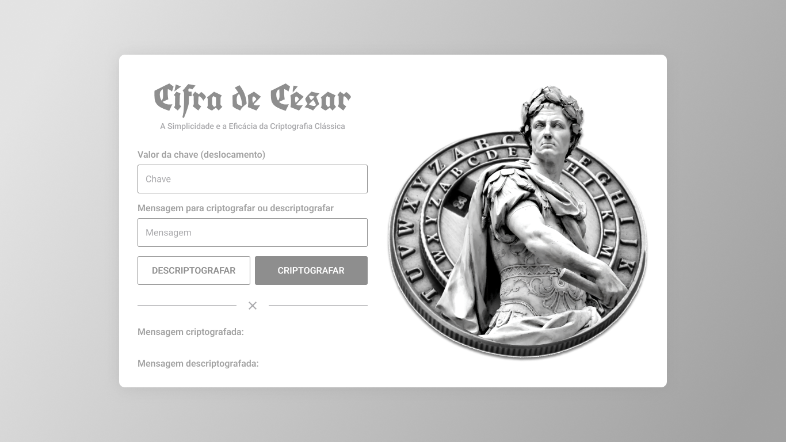

<h2 style="text-align: center;">Trabalho de Segurança e Auditoria de Sistemas</h2>

<h3>Cifra de César</h3>

A Cifra de César é uma técnica de criptografia simples e antiga, usada pelo general romano Júlio César para proteger mensagens secretas. A cifra funciona deslocando cada letra do alfabeto um número fixo de posições. Por exemplo, com um deslocamento de 3, a letra "A" se torna "D", "B" se torna "E", e assim por diante. Apesar de sua simplicidade e vulnerabilidade à criptografia moderna, a Cifra de César é um dos primeiros exemplos de criptografia na história e ainda é estudada como uma introdução aos conceitos de segurança da informação.

<h3>Integrantes do Grupo</h3>
<ul>
    <li>Bruno Cirino</li>
    <li>Ícaro Vieira</li>
    <li>Jéssica Mattos</li>
    <li>José Elias Daros</li> 
    <li>Matheus Zaguetti</li>
</ul>
